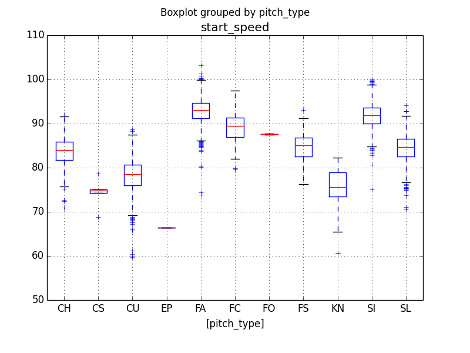
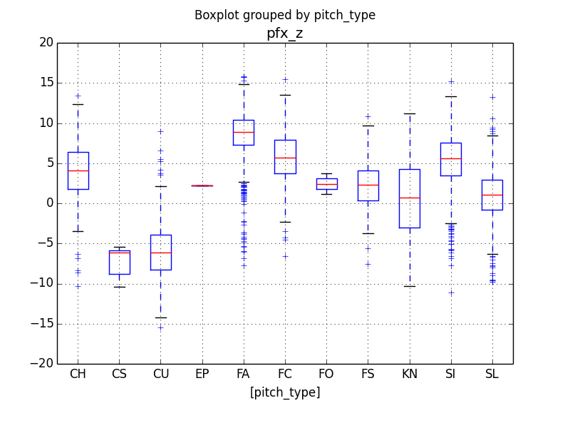
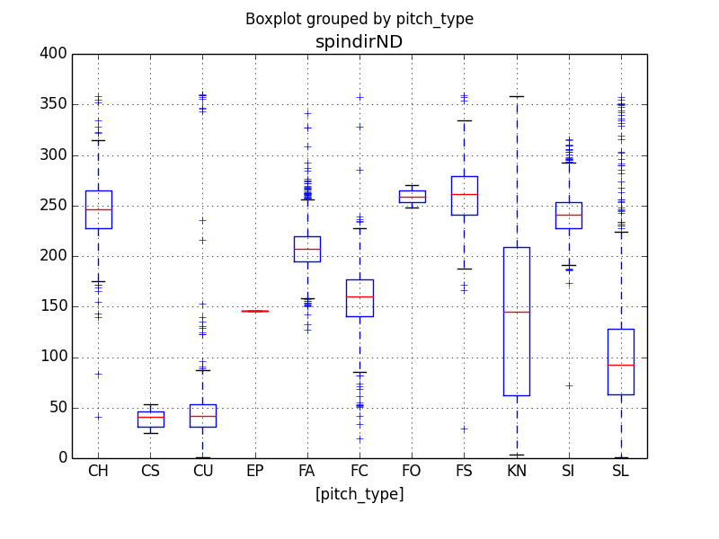
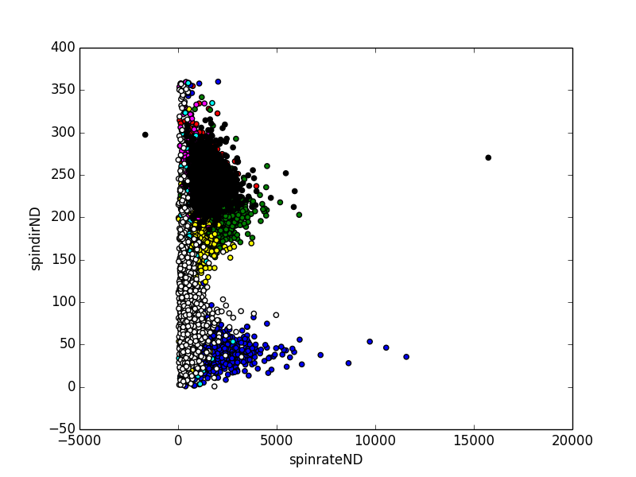

# PitchTypeClassifier
Classify Pitch Types Using PITCHf/x Data

In this repository:

* classifier.py: Python code using the scikit-learn machine learning library to predict the pitch type

* train.csv: PITCHf/x data on 6,920 pitches labeled with its pitch type, roughly representing an accurate distribution of pitch types thrown in the MLB  

* test.csv: PITCHf/x data on 3,413 unlabeled pitches

* TestWithPredictions.csv: test.csv with predicted pitch types

### Introduction
This prediction model was built using scikit-learn's Random Forest Classifier. The final model was built using the entirety of train.csv but originally tested within the labeled data. Using a 60-40 train-test split on the data, the model achieved approximately 76% accuracy and over 90% accuracy in predicting fastballs. A more detailed explanation of the model building process can be found below.

### Feature Selection
There were a number of features that could be immediately removed from consideration as they would have little to no correlation on the pitch type observed. Player names, numerous ids (MLB, Pitch, and AB), initial and final pitch locations, handedness the batter, height, inning, and count were ignored.

*While the individual pitcher and count can certainly be used to better predict a pitch type, the format presented in this dataset does not lend itself to assisting this particular model.*

The remaining features certainly all carry relevance to pitch type, some of course more so than others. Looking at box plots, the distinction and distributions between different pitch types could be visually investigated. A number of these box plots are shown below where the distinction between pitch types seemed fairly evident.

A model-based ranking was then conducted by building a model on each feature individually. The accuracy scores provided additional insight as to which features were most important. These predictions are shown in the table below. Each features ability to predict fastballs was also considered to gain a little extra view on how these features were affecting the model.

*Four-seam Fastballs, Splitters, Sinkers, and Cutters were considered as fastballs. The rest were categorized as Non-Fastballs.*

|  Feature    | Accuracy    | Fastball Accuracy | Non-Fastball Accuracy |
| :---------: | :--------:  | :---------------: | :-------------------: |
| start_speed | 44.15       | 89.45%            | 83.67%                |
| pfx_x       | 44.81       | 79.63%            | 63.42%                |
| pfx_z       | 44.12       | 79.90%            | 68.71%                |
| spinrateND  | 31.06       | 71.98%            | 46.19%                |
| spindirND   | 52.98       | 83.62%            | 68.12%                |
| vxf         | 28.39       | 70.52%            | 42.42%                |
| vzf         | 34.46       | 78.91%            | 56.97%                |
| xangle      | 28.60%      | 70.84%            | 45.37%                |
| zangle      | 37.90%      | 81.53%            | 69.36%                |

Some features like Spin Direction appeared to clearly be very significant in determining the pitch type while others, such as Spin Rate, were less important. A scatter plot is shown below to demonstrate the significance of the two. There is clearly greater distinction on the y-axis (Spin Direction) across pitch types, than there is on the x-axis (Spin Rate).

### Model Selection
A number of classification models were tested with their results shown below. Numerous number of neighbors were tested in the KNN model, however the model never achieved above 70% accuracy. Gaussian (GNB), Multiclass Logistic Regression (LogReg), and Random Forest (RFC) models all produced similar results, though the Random Forest Classifier was chosen as the final model because of its slightly higher accuracy.  

| Classifier | Accuracy |
| :--------: | :------: |
| KNN (15)   | 67.67%   |
| LogReg     | 74.97%   |
| GNB        | 75.37%   |
| RFC        | 75.73%   |

### Conclusion
When the data was trained on 60% of the data and tested on the remaining 40%, the model ended up with an accuracy of approximately 76% across the board, and close to a 93% accuracy when classifying between fastballs and non-fastballs. The model struggled the most in classifying Four-seam Fastballs against Sinkers - approximately 11% of Four-seamers were classified as Sinkers, while 30% of sinkers were classified as Four-seamers. Similarly, the model also had difficulties distinguishing between Cutters and Sliders.

To improve the accuracy of the model, the pitch type frequency by pitcher could be included. Knowing that a pitcher relies heavily on Sliders could improve the models ability to distinguish between that and a Cutter. Similarly, knowing and incorporating the pitch frequency by count could similarly aid the model (e.g the likelihood of a breaking ball is much higher when the pitcher is ahead in the count).
